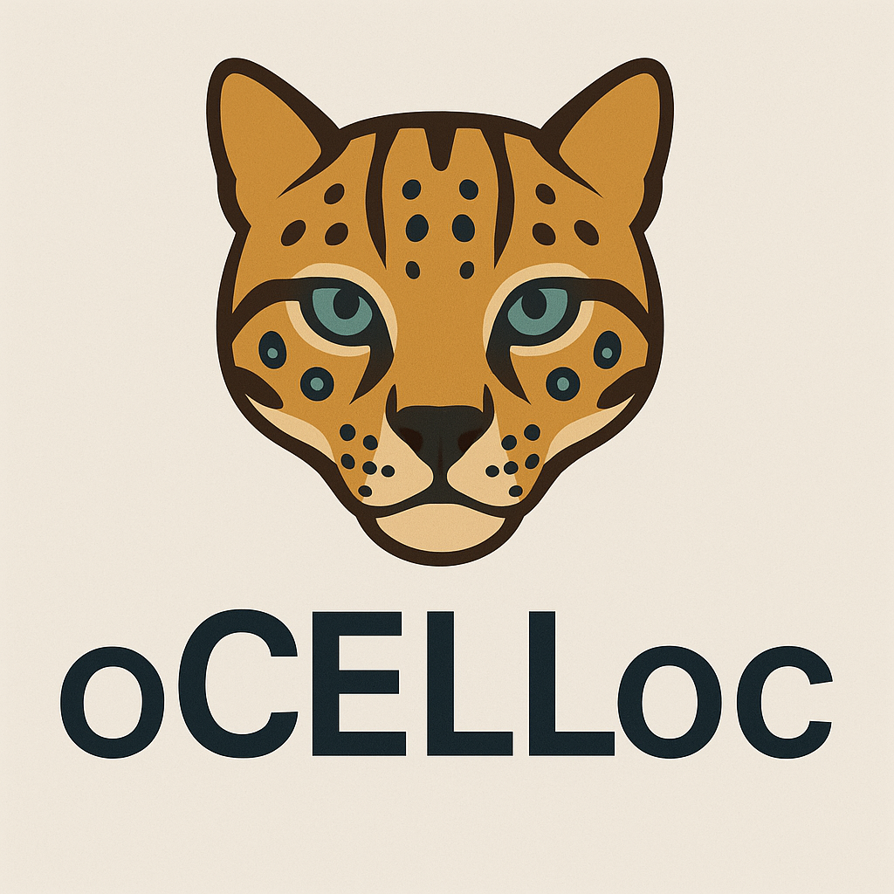

<div align="center">
  
  <h1>oCELLoc</h1>
</div>

**oCELLoc** is an R package designed to predict cell types in spatial transcriptomics data. It leverages advanced computational techniques like Lasso regression to provide insights into spatial patterns of gene expression.

## Package Metadata

- **Package**: oCELLoc
- **Title**: Predicts Suitable Cell Types in Spatial Transcriptomics Data
- **Version**: 1.0.0
- **Authors**: 
  - Afeefa Zainab (`afeeffazainab@gmail.com`) - Author and Creator
  - Vladyslav Honcharuk (`vladyslav.s.honcharuk@gmail.com`) - Author
  - Alexis Vandenbon (`alexisvdb@infront.kyoto-u.ac.jp`) - Author
- **Description**: Picks the suitable cell types in spatial transcriptomics data using Lasso regression. The package includes curated reference gene expression profiles for human and mouse cell types, facilitating immediate application to common spatial transcriptomics datasets. Additionally, users can input custom reference data to support tissue- or experiment-specific analyses.
- **License**: MIT
- **Encoding**: UTF-8

## Installation

You can install the package from GitHub using:

```r
devtools::install_github("afeefa-zainab/oCELLoc")
```
